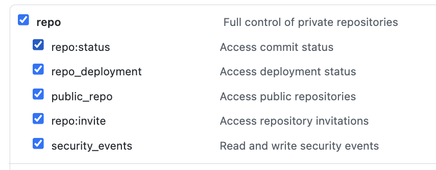

# Gitple Planning Butler (Print Only)

### Installation

- `yarn install`

### Instructions

1. create github [personall access token (classic)](https://docs.github.com/en/authentication/keeping-your-account-and-data-secure/creating-a-personal-access-token)

- set permission scope(s):
  

2. create `.env`, set:

```
TOKEN=YOUR_GITHUB_PERSONAL_ACCESS_TOKEN
TEAM=YOUR_TEAM_NAME
OWNER=YOUR_GITHUB_ORG_NAME
```

3. create a new config json file in ./src/config/ e.g.: `saturn.json`

   - config example:

   ```json
   {
     "issues": [
       { "id": 123, "repo": "repoName" } // id: issue number, repo: repo name
     ]
   }
   ```

4. run `yarn start`
